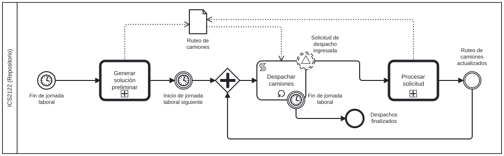
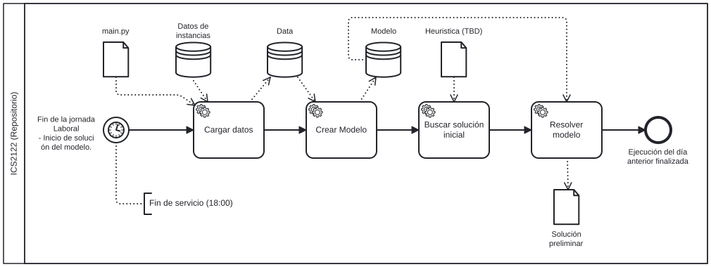
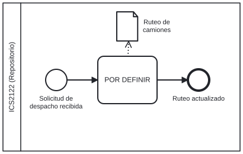

# Repositorio de Taller de Investigación Operativa - ICS2122
Repositorio del código fuente del capstone. Contiene la rutina y los archivos necearios.

## Estructura del repositorio
- `main.bat`: Archivo de ejecución principal, encargado de cargar las variables del entorno y ejecutar el programa.
- `environment/.env.example`: Archivo de ejemplo para configurar las variables de entorno necesarias para el
programa.
- `src/`: Carpeta que contiene el código fuente del proyecto.
- `README.md`: Archivo de documentación del proyecto, que describe la estructura y el propósito de cada archivo.

Funcionamiento General:
La primera propuesta de funcionamiento del repositorio es la siguiente.

De acuerdo al paper *On modeling stochastic dynamic vehicle routing problems*, durante el día anterior la empresa dejará corriendo un modelo de **optimización estocástica de dos etapas**, usando lo que en el texto se denomina como un *lookahead alrogithm (LA)*. Posteriormente, conforme vayan ingresando las solicitudes de despacho durante el día, se ejecutará una **reoptimización** (RO), usando los algoritmos a estudiar.

En primera instancia, se genera una solución preliminar. 

Finalmente, cada vez que llega una nueva solciitud de entrega, se ajusta el ruteo de camiones.

## Reglas del repositorio
- No se deben realizar cambios directamente en la rama `master`, sino crear una branch para cada integrante y sus cambios, siguiendo el formato: 
'develop-<nombre_del_integrante>' (nombre de la branch).
- TODOS los códigos relacionados a Main deben tener flujos de try-except y usar al librería GOing para manejar y registrar errores.
- En caso de trabajar con dataframes, usemos polars en vez de pandas. Es más eficiente.
- Los nombres de los métodos, variables y clases en ingles y con el formato snake y Camel.

## Ejecución
Para ejecutar el repo, es necesario:
1. Clonar el repo en la maquina local.
2. Crear un virtual environment y activarlo en la terminal (command prompt, no powershell): escribir en cmd `python -m venv .venv`
3. Ejecutar main.bat usando call main.bat en la terminal (cmd). Si es la primera ejecución, descomenta la linea pip install -r requirements.txt del main.bat para instalar las librerias.

La gracia es que al usar venv, no estaremos instalando librerias de sobra y la ejecución será más rápida y ágil para la máquina.

