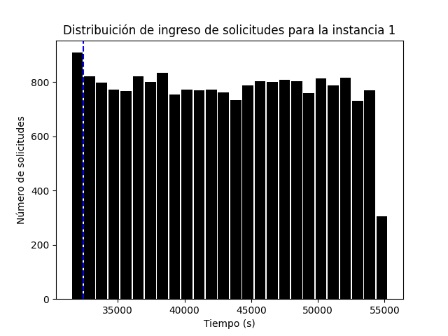
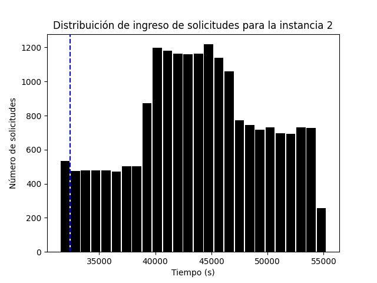
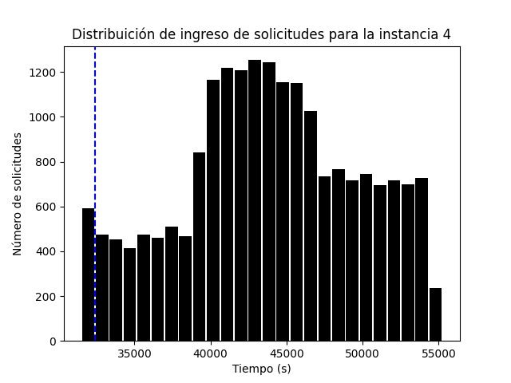

# Análisis de dato preliminar
Hola. De manera preliminar, hice un par de histogramas para pensar en el modelo. A continuación adjuntaré algunos de los resultados.

## Instancia I
En la primera instancia, un 4.45% de las solicitudes llegan **antes de las 9AM**. Por lo tanto solo esté porcentaje corresponde a **clientes estáticos**. Este 4.45% representa 892 solicitudes.

## Instancia II
Aquí, un 2.6% de los clientes son estáticos, equivalente a 524 solicitudes.

## Instancia III
Aquí, un 2.9% de los clientes son estáticos. Esto corresponde a 585 solicitudes.

## Instancia IV
Aquí, un 2.9% de los clientes son estáticos. Esto corresponde a 585 solicitudes.

## Conclusión
Al parecer, dado que a lo más un 3% de las solicitudes se emiten antes de las 9 (osea hasta un 3% corresponde a clientes estáticos), puedo concluir que realizar un modelo clásico de optimización quizas no sea la mejor herramienta principal. En cambio, propongo depender **únicamente de heuristicas** como las descritas en los papers.

A pesar de esto, correr un modelo determinista o uno estocástico de multietapa podría ser una buena idea para tener una comparativa y medir el desempeño de la heurísitca (notar que uno de los objetivos del proyecto es crear un KPI para ver el rendimiento de la solución propuesta, por lo que esto es un buen aprendizaje).